# HIS Database Migration Toolkit

[](https://github.com/yourusername/his-analyzer)
[](LICENSE)
[](https://www.gnu.org/software/bash/)
[](https://www.python.org/)

A comprehensive, enterprise-grade toolkit for analyzing, profiling, and migrating Hospital Information System (HIS) databases. This centralized dashboard provides end-to-end capabilities from database analysis and profiling to schema mapping and configuration generation with live database connectivity.

## ✨ Features

### Core Features
- **🔍 Multi-Database Support**: Analyze MySQL, PostgreSQL, and MSSQL databases
- **📊 Deep Data Profiling**: Column-level statistics, data quality metrics, and composition analysis
- **🗂️ Schema Analysis**: Automatic DDL extraction with schema namespace support
- **🎯 Smart Sampling**: Intelligent data sampling with NULL and empty string filtering
- **⚡ Auto-Dependency Management**: Automatic installation of required database clients
- **📈 HTML Reports**: Beautiful, interactive reports with DataTables integration
- **🔧 Configuration Generator**: Export migration configs in TypeScript/JSON format

### New in v8.0
- **🗄️ Datasource Management**: Centralized database connection profiles with SQLite storage
- **🔌 Connection Pooling**: Singleton pattern for efficient connection reuse across requests
- **🗺️ Enhanced Schema Mapper**: Dual-mode source selection (Run ID or Live Datasource)
- **📡 Live Schema Discovery**: Dynamic table and column loading from connected databases
- **💡 Smart Column Suggestions**: Auto-suggest target columns from actual database schema
- **🎛️ Configuration Repository**: Save and load mapping configurations from project database

---

## 📋 Table of Contents

- [Architecture](#architecture)
- [Requirements](#requirements)
- [Installation](#installation)
- [Quick Start](#quick-start)
- [Configuration](#configuration)
- [Usage](#usage)
- [Workflow](#workflow)
- [Advanced Features](#advanced-features)
- [Troubleshooting](#troubleshooting)
- [Contributing](#contributing)
- [License](#license)

---

## 🏗️ Architecture

```
his-analyzer/
├── app.py                      # Main Streamlit Dashboard Application
├── requirements.txt            # Python Dependencies
├── README.md                   # Documentation
├── migration_tool.db           # SQLite database for datasources & configs
│
├── views/                      # Streamlit Pages
│   ├── schema_mapper.py            # Schema mapping interface (v8.0 enhanced)
│   ├── migration_engine.py         # Migration execution engine
│   └── settings.py                 # Datasource management UI (v8.0 new)
│
├── services/                   # Business Logic
│   └── db_connector.py             # Database connection pool (v8.0 refactored)
│
├── database.py                 # SQLite operations (datasources, configs)
├── config.py                   # Application configuration
├── utils/                      # Utility functions
│   └── helpers.py                  # Common helper functions
│
├── analysis_report/            # Database Analysis Engine
│   ├── config.json                 # Database connection configuration
│   ├── unified_db_analyzer.sh      # Core analysis script (Bash)
│   ├── csv_to_html.py              # HTML report generator
│   └── migration_report/           # Analysis output directory
│       └── YYYYMMDD_HHMM/          # Timestamped report folders
│           ├── ddl_schema/             # DDL export (schema.sql)
│           ├── data_profile/           # CSV and HTML reports
│           └── process.log             # Execution logs
│
└── mini_his/                   # Mock Data Generator
    ├── gen_mini_his.py             # Python data generator
    └── full_his_mockup.sql         # Base SQL schema
```

---

## 🔧 Requirements

### System Requirements

- **Operating System**: Linux, macOS, Windows (via WSL2)
- **Shell**: Bash 4.0+ (auto-switch on macOS)
- **Python**: 3.8 or higher
- **RAM**: 4GB minimum, 8GB+ recommended for large databases

### Database Clients

The toolkit requires database-specific clients:

- **MySQL**: `mysql-client`
- **PostgreSQL**: `libpq` (PostgreSQL client)
- **MSSQL**: `mssql-tools18` (with ODBC driver)

**Note**: On macOS with Homebrew, these dependencies are auto-installed when missing.

### Python Dependencies

- `streamlit >= 1.30.0` - Web dashboard framework
- `pandas >= 2.0.0` - Data manipulation
- `jq` - JSON processor (system package)

---

## 🚀 Installation

### Option 1: Virtual Environment (Recommended)

Using a virtual environment prevents version conflicts with system Python packages.

```bash
# 1. Clone the repository
git clone https://github.com/yourusername/his-analyzer.git
cd his-analyzer

# 2. Create virtual environment
python3 -m venv venv

# 3. Activate virtual environment
source venv/bin/activate        # macOS/Linux
# venv\Scripts\activate         # Windows

# 4. Install dependencies
pip install --upgrade pip
pip install -r requirements.txt
```

### Option 2: System-Wide Installation

```bash
# Install Python dependencies
pip3 install -r requirements.txt

# Install system dependencies (macOS with Homebrew)
brew install jq

# Install database clients as needed
brew install mysql-client
brew install libpq
brew tap microsoft/mssql-release && brew install mssql-tools18
```

---

## ⚡ Quick Start

### 1. Initialize Project Database

On first run, the application automatically creates `migration_tool.db` SQLite database:

```bash
# Start the Streamlit application
streamlit run app.py
```

**The database is created automatically** with the following tables:
- `datasources` - Stores database connection profiles
- `configs` - Stores schema mapping configurations

**No manual setup required!** The database initialization happens on application startup.

### 2. Configure Datasources (New in v8.0)

Navigate to **Settings** page in the Streamlit interface to manage datasources:

1. Click **"⚙️ Settings"** in the sidebar
2. Select **"Datasources"** tab
3. Click **"Add New Datasource"**
4. Fill in connection details:
   - Name (unique identifier)
   - Database Type (MySQL, PostgreSQL, MSSQL)
   - Host, Port, Database Name
   - Username, Password
5. Test connection
6. Save datasource

**Datasources are stored in SQLite** and reused across:
- Schema Mapper (source & target selection)
- Migration Engine (connection profiles)
- All database operations (via connection pool)

### 3. Configure Database Connection (Legacy - for Bash analyzer)

Edit `analysis_report/config.json`:

```json
{
  "database": {
    "type": "mysql",
    "host": "localhost",
    "port": "3306",
    "name": "hospital_db",
    "user": "root",
    "password": "your_password",
    "schema": "",
    "tables": []
  },
  "sampling": {
    "default_limit": 10,
    "max_text_length": 300,
    "deep_analysis": true,
    "exceptions": []
  }
}
```

### 4. Run Database Analysis (Optional - for CSV-based mapping)

```bash
cd analysis_report
./unified_db_analyzer.sh
```

**Output**: Creates timestamped report in `migration_report/YYYYMMDD_HHMM/`

**Note**: In v8.0, you can also connect directly to datasources in Schema Mapper, bypassing the need for analysis reports.

---

## ⚙️ Configuration

### Database Configuration

#### Basic Settings

| Field      | Description                | Example                        |
| ---------- | -------------------------- | ------------------------------ |
| `type`     | Database type              | `mysql`, `postgresql`, `mssql` |
| `host`     | Database host              | `localhost`, `192.168.1.100`   |
| `port`     | Database port              | `3306`, `5432`, `1433`         |
| `name`     | Database name              | `hospital_db`                  |
| `user`     | Username                   | `admin`                        |
| `password` | Password                   | `secure_password`              |
| `schema`   | Schema name (optional)     | `public`, `dbo`                |
| `tables`   | Specific tables (optional) | `["patients", "visits"]`       |

#### Schema Support (v7.0+)

Specify database schema for PostgreSQL and MSSQL:

```json
{
  "database": {
    "type": "postgresql",
    "schema": "public",
    ...
  }
}
```

**Defaults**:

- PostgreSQL: `public`
- MSSQL: `dbo`
- MySQL: Not applicable

#### Sampling Configuration

| Parameter         | Description                    | Default |
| ----------------- | ------------------------------ | ------- |
| `default_limit`   | Number of sample rows          | `10`    |
| `max_text_length` | Max characters for text fields | `300`   |
| `deep_analysis`   | Enable detailed statistics     | `true`  |
| `exceptions`      | Per-column overrides           | `[]`    |

#### Exception Rules

Override sampling limits for specific columns:

```json
{
  "sampling": {
    "exceptions": [
      { "table": "patients", "column": "notes", "limit": 3 },
      { "table": "visits", "column": "diagnosis", "limit": 5 }
    ]
  }
}
```

---

## 📖 Usage

### Database Analysis Script

```bash
cd analysis_report
./unified_db_analyzer.sh
```

**Features**:

- Auto-detects database type from `config.json`
- Checks and installs missing dependencies (macOS with Homebrew)
- Exports DDL schema to `schema.sql`
- Generates CSV data profile
- Creates interactive HTML report
- Logs all operations to `process.log`

**Output Structure**:

```
migration_report/20251124_0023/
├── ddl_schema/
│   └── schema.sql              # Complete DDL export
├── data_profile/
│   ├── data_profile.csv        # Raw profiling data
│   └── data_profile.html       # Interactive report
└── process.log                 # Execution log
```

### Streamlit Dashboard

The dashboard provides several interfaces:

#### 📊 **Schema Mapper** (v8.0 Enhanced)

**Dual Source Mode:**
- **Run ID Mode**: Load from CSV analysis reports (legacy)
- **Datasource Mode**: Connect directly to live database (new!)

**Features:**
- View table and column statistics
- Map source to target fields with live schema discovery
- Smart target column suggestions from actual database
- Select data transformers and validators
- Save/load configurations from project database
- Generate TypeScript/JSON configurations
- Export configurations as downloadable files

**Workflow:**
1. **Source Configuration**: Choose Run ID or Datasource
   - Run ID: Select from analysis report folders
   - Datasource: Select datasource → Choose table (auto-loads schema)
2. **Target Configuration**: Select target datasource and table
3. **Field Mapping**: Map source columns to target with suggestions
4. **Save Configuration**: Store in SQLite for reuse
5. **Export**: Download as JSON for migration tools

#### ⚙️ **Settings** (v8.0 New)

**Datasources Tab:**
- Add/Edit/Delete datasource profiles
- Test database connections
- View all configured datasources
- Secure credential storage in SQLite

**Saved Configs Tab:**
- View all saved schema mapping configurations
- Load configurations for editing
- Delete unused configurations
- Export configurations

#### 🚀 **Migration Engine**

- Select source and target from datasource profiles
- Load saved configurations from project database
- Upload configuration files
- Execute data migration (simulation mode)

#### 🔍 **DDL Explorer**

- Browse database schema
- Click tables to view CREATE statements
- Navigate foreign key relationships

#### 🎲 **Mock Data Generator**

- Generate test data for migration testing
- Configurable data volumes
- Realistic HIS data patterns

---

## 🔄 Workflow

```mermaid
flowchart TD
    A[📝 Configure config.json] --> B{Select Database Type}
    B -->|MySQL| C1[MySQL Client]
    B -->|PostgreSQL| C2[PostgreSQL Client]
    B -->|MSSQL| C3[MSSQL Client + SSL]

    C1 --> D[🔍 unified_db_analyzer.sh]
    C2 --> D
    C3 --> D

    D --> E{Check Dependencies}
    E -->|Missing| F[🔧 Auto-Install via Homebrew]
    E -->|Available| G
    F --> G[⚙️ Start Analysis]

    G --> H1[📊 Table Size & Row Count]
    G --> H2[🔎 Column Profiling]
    G --> H3[📋 DDL Export]

    H2 --> I{Deep Analysis?}
    I -->|true| J[📈 Min/Max/Top5/Composition]
    I -->|false| K[Basic Stats Only]

    J --> L[🎯 Smart Sample<br/>NOT NULL & NOT EMPTY]
    K --> L

    L --> M[💾 Export to CSV]
    M --> N[🌐 Generate HTML Report]
    N --> O[📂 migration_report/YYYYMMDD_HHMM/]

    O --> P[🖥️ Open in Streamlit Dashboard]
    P --> Q[🗺️ Schema Mapping & Config Generation]

    style D fill:#4CAF50,color:#fff
    style L fill:#FF9800,color:#fff
    style O fill:#2196F3,color:#fff
    style Q fill:#9C27B0,color:#fff
```



### Step-by-Step Migration Process

1. **Database Analysis**

   - Configure `config.json` with source database credentials
   - Run `./unified_db_analyzer.sh`
   - Review generated reports

2. **Schema Mapping**

   - Launch Streamlit dashboard
   - Navigate to **Schema Mapper**
   - Load analysis report
   - Map source fields to target schema
   - Select transformers (e.g., date format converters, string normalizers)

3. **Configuration Export**

   - Generate TypeScript/JSON configuration
   - Integrate with migration pipeline
   - Test with mock data if needed

4. **Migration Execution**
   - Use generated config with your ETL tool
   - Monitor data quality metrics
   - Validate migrated data

---

## 🚀 Advanced Features

### Connection Pooling (v8.0)

The toolkit uses a singleton connection pool pattern for efficient database operations:

**Benefits:**
- Reuses connections across multiple requests
- Automatic health checks and reconnection
- Significant performance improvement for repeated operations
- Thread-safe connection management

**How it works:**
```python
# First call - creates connection
get_tables_from_datasource(...)  # Creates new connection

# Second call - reuses connection (no overhead!)
get_columns_from_table(...)      # Reuses existing connection

# Connection stays alive for future requests
```

**Connection Management:**
- Connections are identified by unique hash (host, port, db, user)
- Dead connections are automatically detected and recreated
- All functions use autocommit mode for stability
- Connections persist across Streamlit reruns

**Manual Control:**
```python
from services.db_connector import close_connection, close_all_connections

# Close specific connection
close_connection(db_type, host, port, db_name, user)

# Close all connections (useful for cleanup)
close_all_connections()
```

### Project Database (v8.0)

**SQLite Storage:** `migration_tool.db`

**Tables:**

1. **datasources** - Database connection profiles
   ```sql
   CREATE TABLE datasources (
       id INTEGER PRIMARY KEY AUTOINCREMENT,
       name TEXT UNIQUE,
       db_type TEXT,
       host TEXT,
       port TEXT,
       dbname TEXT,
       username TEXT,
       password TEXT
   )
   ```

2. **configs** - Schema mapping configurations
   ```sql
   CREATE TABLE configs (
       id INTEGER PRIMARY KEY AUTOINCREMENT,
       config_name TEXT UNIQUE,
       table_name TEXT,
       json_data TEXT,
       updated_at TIMESTAMP
   )
   ```

**Automatic Initialization:**
- Database created on first application run
- No manual SQL scripts required
- Handles migrations automatically

### Schema Mapper Dual Mode (v8.0)

**Mode 1: Run ID (Traditional)**
- Uses CSV analysis reports
- Offline operation
- Historical data analysis
- Best for: Initial exploration, documented analysis

**Mode 2: Datasource (New)**
- Connects directly to live database
- Real-time schema discovery
- Auto-loads tables and columns
- Best for: Active development, latest schema

**Switching between modes:**
1. Open Schema Mapper
2. Select source mode (Run ID / Datasource)
3. Choose source accordingly
4. Schema Mapper adapts automatically

### Deep Analysis Mode

Enable comprehensive data profiling:

```json
{
  "sampling": {
    "deep_analysis": true
  }
}
```

**Metrics Collected**:

| Metric           | Basic Mode | Deep Mode                  |
| ---------------- | ---------- | -------------------------- |
| Row Count        | ✅         | ✅                         |
| Null Count       | ✅         | ✅                         |
| Distinct Values  | ✅         | ✅                         |
| Min/Max Values   | ❌         | ✅                         |
| Top 5 Frequency  | ❌         | ✅                         |
| Data Composition | ❌         | ✅ (Valid/Null/Empty/Zero) |
| Sample Data      | ✅         | ✅ (Smart filtered)        |

**Performance Considerations**:

- **Basic Mode**: Fast, suitable for large tables (millions of rows)
- **Deep Mode**: Slower, recommended for detailed migration planning

### Smart Sample Data (v7.1+)

Automatically filters sample data to show only meaningful values:

**Filtering Rules**:

- Excludes `NULL` values
- Excludes empty strings (`''`)
- Shows actual representative data

**Implementation** (MySQL example):

```sql
SELECT DISTINCT column_name
FROM table_name
WHERE column_name IS NOT NULL
  AND CAST(column_name AS CHAR) <> ''
LIMIT 10;
```

### Auto-Dependency Installation

On macOS with Homebrew, missing database clients are automatically installed:

```bash
# Example: Installing MSSQL tools
❌ Error: Command 'sqlcmd' not found
🍺 Homebrew detected...
❓ Install 'mssql-tools18' now? (y/N): y
📦 Installing mssql-tools18...
   -> Tapping microsoft/mssql-release...
   -> Installing packages...
✅ Installation successful!
```

### Interactive HTML Reports

Generated HTML reports include:

- **Overview Tab**: Table-level metrics with sortable DataTable
- **Column Detail Tab**: Comprehensive column-level statistics
- **Formulas & Docs Tab**: Data quality score explanations
- **Process Log Tab**: Complete execution logs

**Features**:

- Responsive design with Bootstrap 5
- Interactive tables with search/filter/sort
- Data quality visualizations
- Exportable to Excel/CSV/PDF

---

## 🐛 Troubleshooting

### Common Issues

#### Issue: `TypeError: data_editor() got an unexpected keyword argument 'selection_mode'`

**Cause**: Outdated Streamlit version (< 1.30.0)

**Solution**:

```bash
# Option 1: Use virtual environment (recommended)
python3 -m venv venv
source venv/bin/activate
pip install --upgrade streamlit

# Option 2: Force reinstall
pip uninstall streamlit -y
pip install --upgrade --force-reinstall streamlit
```

#### Issue: MSSQL SSL Certificate Error

**Cause**: Self-signed or untrusted SSL certificate

**Solution**: The toolkit automatically adds `-C` flag to trust server certificates:

```bash
sqlcmd -S host,port -C -U user -P password ...
```

#### Issue: `Must declare the scalar variable '@VariableName'`

**Cause**: T-SQL variable scope in dynamic SQL

**Solution**: Already handled in v7.1+ with proper variable injection

#### Issue: Empty CSV Output

**Cause**: Incorrect schema name (e.g., using default `public` for MSSQL)

**Solution**: Specify correct schema in `config.json`:

```json
{
  "database": {
    "type": "mssql",
    "schema": "dbo"
  }
}
```

### Getting Help

1. Check the `process.log` in the report folder
2. Review error messages in the terminal output
3. Verify database connectivity with native clients:
   ```bash
   mysql -h host -u user -p
   psql -h host -U user -d database
   sqlcmd -S host,port -U user -P password
   ```
4. Open an issue on GitHub with:
   - Error message
   - Database type and version
   - Operating system
   - Relevant log excerpts

---

## 🧪 Testing

### Run Mock Data Generator

```bash
cd mini_his
python gen_mini_his.py
```

### Test Database Analysis

```bash
cd analysis_report

# Edit config.json to point to test database
./unified_db_analyzer.sh

# Verify output
ls -lh migration_report/*/data_profile/data_profile.csv
```

---

## 📊 Performance Benchmarks

Approximate analysis times (single table):

| Rows | Columns | Basic Mode | Deep Mode |
| ---- | ------- | ---------- | --------- |
| 10K  | 20      | ~2s        | ~5s       |
| 100K | 50      | ~10s       | ~30s      |
| 1M   | 100     | ~30s       | ~2min     |
| 10M+ | 200+    | ~2min      | ~10min+   |

**Optimization Tips**:

- Use `tables` filter to analyze specific tables only
- Disable `deep_analysis` for initial exploration
- Adjust `default_limit` for faster sampling

---

## 🤝 Contributing

Contributions are welcome! Please follow these guidelines:

### Reporting Bugs

- Use GitHub Issues
- Include error messages and logs
- Provide reproduction steps
- Specify environment details

### Suggesting Features

- Open a GitHub Discussion
- Describe use case and benefits
- Provide examples if possible

### Pull Requests

1. Fork the repository
2. Create a feature branch (`git checkout -b feature/amazing-feature`)
3. Commit changes (`git commit -m 'Add amazing feature'`)
4. Push to branch (`git push origin feature/amazing-feature`)
5. Open a Pull Request

**Code Standards**:

- Bash scripts: Follow ShellCheck recommendations
- Python: PEP 8 style guide
- Add comments for complex logic
- Update documentation for new features

---

## 📝 License

This project is licensed under the MIT License - see the [LICENSE](LICENSE) file for details.

---

## 🙏 Acknowledgments

- Built for healthcare professionals managing HIS migrations
- Inspired by enterprise database migration challenges
- Community feedback and contributions welcome

---

## 📞 Support

- **Documentation**: This README and inline code comments
- **Issues**: [GitHub Issues](https://github.com/yourusername/his-analyzer/issues)
- **Discussions**: [GitHub Discussions](https://github.com/yourusername/his-analyzer/discussions)

---

## 🗺️ Roadmap

### Completed ✅
- [x] Datasource management with SQLite storage (v8.0)
- [x] Connection pooling and reuse (v8.0)
- [x] Dual-mode schema mapper (Run ID / Datasource) (v8.0)
- [x] Live schema discovery (v8.0)
- [x] Configuration repository (v8.0)
- [x] Smart column suggestions (v8.0)

### Planned
- [ ] Support for Oracle Database
- [ ] REST API for programmatic access
- [ ] Docker containerization
- [ ] CI/CD pipeline integration
- [ ] Data anonymization features
- [ ] Migration progress tracking
- [ ] Rollback capabilities
- [ ] Data validation dashboard
- [ ] Migration scheduling
- [ ] Multi-datasource data lineage tracking

---

**Made with ❤️ for the HIS migration community**
